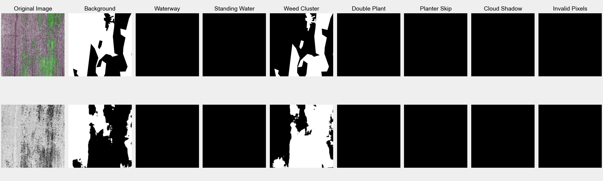

# Crop Field Health



## Background

There are over 400 million acres of farmland in the United States, which traditionally must be monitored on foot to detect anomalies, an extensively time-consuming task. 
A farmland anomaly is any object, region, or event that disrupts the normal growth stages of crops, which if left unchecked, can drastically decrease the yield of a farm.

Some of the most harmful farmland anomalies to potential crop yield are:
- **clusters of weeds**, which inhibit crop growth and nutrient gains,
- **stagnant water**, which can serve as a breeding ground for harmful bacteria and pests,
- **unintended waterways**, which can destroy plants in their paths, and 
- **missed** or **double planting**, which prevents maximum planting efficiency.

I have used deep neural networks to conduct semantic image segmentation on aerial images of farmland, to classify and determine the 
locations of these anomalies
such as weed clusters, skipped planting, and water destruction. Considering the expansiveness of global crop fields,
it is near-impossible to patrol crop fields on foot and resource-consuming and often largely expensive to try and have 
humans analyze aerial images using existing technologies. 

This project simplifies existing solutions and provides an 
accurate and efficient solution for analyzing agricultural images, a relatively untouched field.

## Structure 

The data pipelines and system is developed in multiple stages, owing to the complexity of the Agriculture-Vision dataset (see below).
First, the dataset is inflated from its compressed files using the `scripts/expand.sh` script. Then, the `scripts/generate.sh` calls the
`preprocessing/generate.py` script, which creates JSON files containing all image paths for a unique image ID. Finally, the `preprocessing/dataset.py`
file contains the `AgricultureVisionDataset` object which is called from implementation scripts as training data.

For data inspection, including viewing all images associated with an ID or viewing all images belonging to a category, the `preprocessing/inspect.py`
contains functionality for viewing and saving these images.

## Usage

You can install the repository from the command line:

```shell script
git clone https://github.com/amogh7joshi/crop-field-health.git
```

### Python Setup

A Makefile is included for Python installation. To use it, run the following.

```shell script
make install
```

Otherwise, in the proper directory, execute the following to install system requirements.

```shell script
python3 -m pip install -r requirements.txt
```

From here, the `scripts/expand.sh` script inflates the dataset into its permanent file structure, and 
the `scripts/preprocess.sh` processes the dataset into JSON files containing image paths for each image ID.

### C++ Setup

If you want to work with the C++ extensions of the project, which are located in the `cc` directory, then 
follow the above steps for repository installation and Python setup. 

From there, you need to build the C++ project. You will need CMake installed, as well as 
[OpenCV](https://docs.opencv.org/master/d7/d9f/tutorial_linux_install.html) (for working with images) 
and [nlohmann-json](https://github.com/nlohmann/json#package-managers) (for working with JSON files). Once you have those
installed, execute:

```shell script
cmake -DCMAKE_BUILD_TYPE=Debug -G "CodeBlocks - Unix Makefiles" path/to/farmland-anomalies/cc
```

You can run the compiled C++ executables from there, by running `make` in the `cc` directory to build the files and then:

```shell script
./cc
```


## Agriculture-Vision Dataset

This project makes use of the Agriculture-Vision dataset, containing aerial crop field images from multiple classes.
The dataset can be requested from the challenge [website](https://www.agriculture-vision.com/contact-us), and for compatibility
the compressed file should be placed in the `data` directory.

```bibtex
@article{chiu2020agriculture,
         title={Agriculture-Vision: A Large Aerial Image Database for Agricultural Pattern Analysis},
         author={Mang Tik Chiu and Xingqian Xu and Yunchao Wei and Zilong Huang and Alexander Schwing 
                 and Robert Brunner and Hrant Khachatrian and Hovnatan Karapetyan and Ivan Dozier and Greg Rose 
                 and David Wilson and Adrian Tudor and Naira Hovakimyan and Thomas S. Huang and Honghui Shi},
         journal={arXiv preprint arXiv:2001.01306},
         year={2020}
}
```


